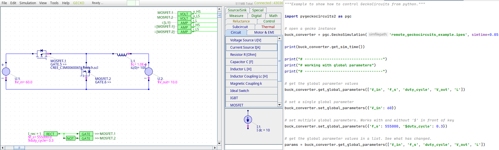

.. sectnum::

Welcome to PyGeckoCircuits2
==================================================
This repository was inspired by `MaurerM/pygeckocircuits <https://github.com/MauererM/pygeckocircuits>`__, added by certain functions and a pip-installable package.

Control a GeckoCircuits simulation by Python code.

Installation
---------------------------------------
Install pygeckocircuits2 directly from pyPI:

::

    pip install pygeckocircuits2

Usage
---------------------------------------
Download the compiled gecko-version from `tinix84/gecko <https://github.com/tinix84/gecko/releases/tag/v1.1>`__.

Run the `example file <https://github.com/upb-lea/pygeckocircuits2/blob/main/examples/remote_geckocircuits_example.py>`__ to see the given functions.

Documentation
---------------------------------------

Find the documentation `here <https://upb-lea.github.io/pygeckocircuits2/intro.html>`__.

Troubleshooting
---------------------------------------
 * As of now, there are issues with OpenJDK 21 (LTS). Please use OpenJDK 17 (LTS) so far. See also `this issue <https://github.com/tinix84/gecko/issues/1>`__.

PyGeckoCircuits2 class and function documentation
==================================================
The ``GeckoSimulation`` class
---------------------------------------
.. currentmodule:: pygeckocircuits2.GeckoSimulation

.. autoclass:: pygeckocircuits2.GeckoSimulation
   :members: save_file, open_file, run_simulation, set_global_parameters, get_global_parameters, get_sim_time, set_sim_time, get_component_keys, get_component_values, set_component_values, set_switch_values, set_loss_file, get_switch_keys, get_scope_data, get_values

   :special-members: __init__